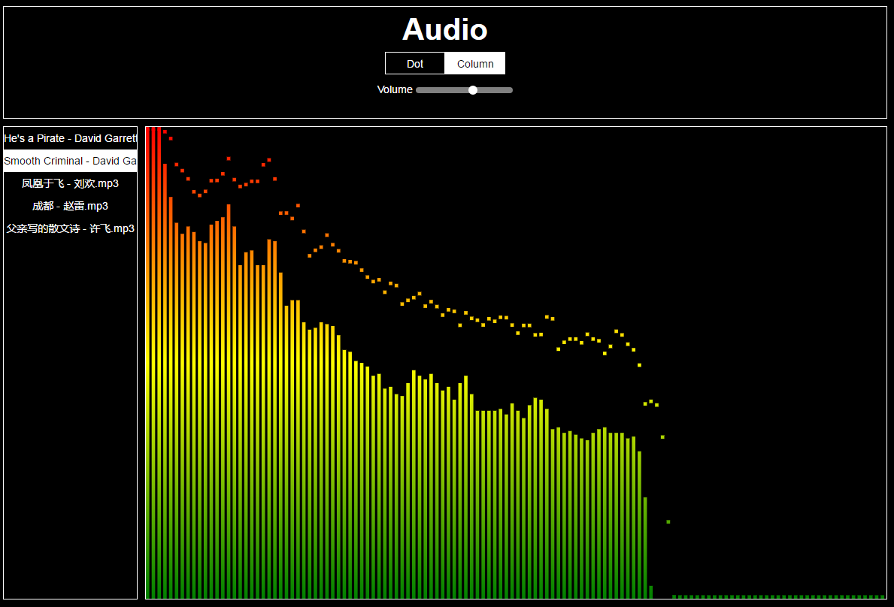

## Audio



```bash
npm install express-generator -g

express -e audio

cd audio

npm install

# supervisor必须安装到全局，node热部署
npm install supervisor -g 

# visit http://localhost:3000/
supervisor bin/www 
```

## Tips

* 单纯设置`text-overflow:clip;`无效，必须加上文本在一行内显示`white-space:nowrap;`和溢出内容隐藏`overflow:hidden;`才能实现文本溢出效果。

* [ArrayBuffer](http://www.zhangxinxu.com/wordpress/2013/10/understand-domstring-document-formdata-blob-file-arraybuffer/)：固定长度的二进制数据缓冲区，其实就是装着二进制数据的对象，不能读写，需要借助DataView对象或类型化数组对buffer内容进行读写。

* [AudioContext](https://developer.mozilla.org/zh-CN/docs/Web/API/AudioContext): audio上下文对象，包含各个音频处理模块AudioNode对象。
```
var ac = new window.AudioContext();
属性：
destination：音频输出地
currentTime：上下文创建开始到当前的时间
方法：
decodeAudioData(arrayBuffer, successcallback(buffer), errcallback)：异步解码包含在arrayBuffer中的音频数据
createBufferSource()：创建audioBufferSourceNode对象
createAnalyser()：创建AnalyserNode对象，获取音频时间和频率数据，实现数据可视化
createGain()：创建GainNode对象，用于控制增益音频图
```


* [AudioBufferSourceNode](https://developer.mozilla.org/zh-CN/docs/Web/API/AudioBufferSourceNode)：内存中的音频资源，音频数据存在于AudioBuffer中。
```
var bufferSource = ac.createBufferSource();
属性：
buffer：AudioBuffer对象，要播放的音频资源数据。子属性duration资源时长
loop：是否循环播放
onended：音频播放完毕调用
方法：
start/noteOn(when=ac.currentTime, offset=0, duration=buffer.duration-offset)：开始播放音频，什么时间开始播放，从第几秒开始播放，播放几秒
stop/noteOff(when=ac.currentTime)：结束播放音频
```

* [GainNode](https://developer.mozilla.org/zh-CN/docs/Web/API/GainNode)：改变音频音量的对象
```
var gainNode = ac.createGain();
gain：AudioParam对象，通过改变value值可以改变音频信号的强弱，0~1
```

* [AnalyserNode](https://developer.mozilla.org/zh-CN/docs/Web/API/AnalyserNode)：音频分析对象，能实时分析音频资源的频域和时域信息，但不对音频流做任何处理
```
var analyser = ac.createAnalyser();
fftSize: 设置FFT(离散傅里叶变换，将信号变换到频域)值的大小
frequencyBinCount: 实时得到的音频频域的个数，FFT值的一半
getByteFrequencyData(Uint8Array): 复制音频当前的频域数据，用于可视化
```

* [Web Audio API](https://webaudio.github.io/web-audio-api/)

* 实现思路：每次点击歌单，ajax异步请求音频资源ArrayBuffer对象，通过AudioContext上下文对象对ArrayBuffer中的音频数据进行解码，解码成功拿到AudioBufferSourceNode对象存储音频资源用于下面的频域时域和音量分析。创建AnalyserNode对象用于音频资源的频域时域，同时使用requestAnimationFrame获得实时频域数据canvas绘制，连接到GainNode对象分析音频音量，再连接到AudioContext上下文的destination，最后必须连接到这里。