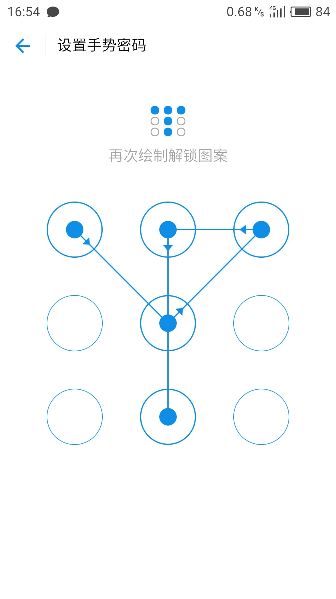

## HTML5手势解锁 

demo手机端扫码看啦~

### 实现思路

1. 根据预先设定的圆圈半径以及圆圈圆心之间距离计算top和left偏移量，然后绘制圆圈

2. 监听触控事件，drawPath方法绘制路径的思路是根据 path数组中记录的路径 以及 手指未释放的点 挨个绘制点和线。
	* touchstart：手指按下就应该绘制了
	* touchmove：绘制线在touchmove的过程中每帧需要清空画布重新绘制，这一点有点耗性能，因为实际需要重绘的只是最后一条手指还未释放的线。
	* touchend：根据mark标记判断是手势密码锁的哪个阶段(设置密码->确认密码->解锁)

3. 没有对这种情况进行处理：同一行的三个点，选中第一个点，绕开第二个点，再连接第三个点，是否需要将第二个点也自动加入路径中。因为手机端下面这种情况也是合理的：

