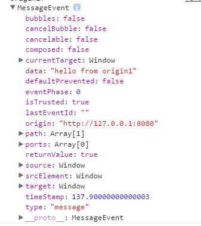

## PostMessage

postMessage用于两个窗口iframe之间交换数据。两个窗口能通信的前提是：一个窗口以iframe的形式存在于另一个窗口中(MessageEvent.source获取源窗口)，或者一个窗口是从另一个窗口通过window.open()或超链接形式打开的(同样可以用window.opener获取源窗口)。也就是说要想交换数据，必须能获取目标窗口的引用。

### postMessage的使用

```
otherWindow.postMessage(message, targetOrigin)
```
参数message支持字符串、json等几乎所有形式的数据。

targetOrigin是接收方的URI(协议+主机+端口)。用通配符`*`可以指定所有域，但是会有安全问题。

otherWindow是对接收方窗口的引用，一般可以是一下方式：
```
window.frames[0]
document.getElementByTagName('iframe')[0].contentWindow
window.opener
event.source
window.open 返回的引用
```

接收方监听message事件
```
window.addEventListener('message', function(e){})
```

### MessageEvent的几个重要属性：



* data：传递来的数据

* source：发送消息的窗口对象(可以用它来引用发送窗口进行消息回传)

* origin：发送消息窗口的源(协议+主机+端口号)


### 安全性

postMessage采用的是双向安全机制，发送方发送数据时，会确认接收方的源（所以最好不要使用通配符），而接收方监听到message事件后，也可以用event.origin判断是否来自于正确可靠的发送方。


### 多说一句

发现HTML5的工作线程Web Workers中，主线程与工作线程之间通信也是使用postMessage和onmessage。


